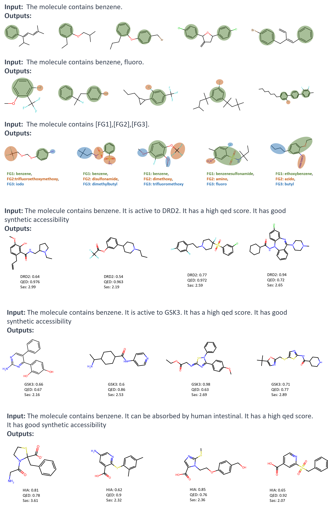

[](https://github.com/HHW-zhou/TSMMG)
[](https://www.researchsquare.com/article/rs-3845824/v1)


# TSMMG
**Instruction Multi-Constraint Molecular Generation Using a Teacher-Student Large Language Model**  
While various models and computational tools have been proposed for structure and property analysis of molecules, generating molecules that conform to all desired structures and properties remains a challenge. Here, we introduce a multi-constraint molecular generation large language model, TSMMG, which, akin to a student, incorporates knowledge from various small models and tools, namely, the 'teachers'. To train TSMMG, we construct a large set of text-molecule pairs by extracting molecular knowledge from these 'teachers', enabling it to generate novel molecules that conform to the descriptions through various text prompts. We experimentally show that TSMMG remarkably performs in generating molecules meeting complex, natural language-described property requirements across two-, three-, and four-constraint tasks, with an average molecular validity of over 99% and success ratio of 88.08%, 65.27%, and 61.44%, respectively. The model also exhibits adaptability through zero-shot testing, creating molecules that satisfy combinations of properties that have not been encountered. It can comprehend text inputs with various language styles, extending beyond the confines of outlined prompts, as confirmed through empirical validation. Additionally, the knowledge distillation feature of TSMMG contributes to the continuous enhancement of small models, while the innovative approach to dataset construction effectively addresses the issues of data scarcity and quality, which positions TSMMG as a promising tool in the domains of drug discovery and materials science.


# Framework of TSMMG




# Environments
```shell
conda create -n tsmmg python=3.10.9
conda activate tsmmg
pip install torch==2.0.1 torchvision==0.15.2 torchaudio==2.0.2              # cuda 11.7
pip install transformers
pip install rdkit
pip install pandas
pip install accelerate
pip install weasyprint
pip install libsvm-official
pip install matplotlib
pip install datasets
```

# Data Preparation

Download the necessary data for this project from either [Baidu Cloud](https://pan.baidu.com/s/10bgr9-KLR0x38BBeuvMykQ?pwd=3ezz) or [Google Drive](https://drive.google.com/file/d/1xfDh5kBjZZTY5uPc4kBq6u8Rp7ufrTO4/view?usp=drive_link). Please choose the platform that is most convenient for you.

Move the downloaded TSMMG.zip file to the same directory as the TSMMG source code. For example:
```shell
pwd
>> /home/gary

ls
>> TSMMG TSMMG.zip
```

Next, unzip the compressed data files:
```shell
unzip TSMMG.zip
cd TSMMG
tar -zxvf model.tar.gz                # this is an example of trained weights
```

Finally, unzip the compressed source files:
```shell
tar -zxvf TARGET.tar.gz
tar -zxvf ADMET.tar.gz
```

# Training
To train the model, use the following command:
```shell
accelerate launch train.py --batch_size=16 --gpu_num=8 --epochs=2
```

# Inference
We've provided an example of trained weights, so you can directly run the following code for evaluation without needing to train a new model.

Use the following command for evaluation:
```shell
python eval.py --eval_type=[TASK_NAME] --cuda=[CUDA_NO] --eval_model_path=[SAVED_MODEL_PATH]
```

In the above commands, replace [TASK_NAME] with the task you want to evaluate, [CUDA_NO] with the number of the CUDA device you want to use, and [SAVED_MODEL_PATH] with the path to the saved model you want to evaluate.

For examples:
```shell
python eval.py --eval_type=drd2 --cuda=0 --eval_model_path='./model_save_675354_0'
```

The inference time will be approximately 15 minutes for 5000 molecules (on Tesla V100).

The generated SMILES will be in the file './outputs/ouputs_drd2.csv'.

# Cite

*  Xiangxiang Zeng, Peng Zhou, Jianmin Wang et al. Instruction Multi-Constraint Molecular Generation Using a Teacher-Student Large Language Model, 19 March 2024, PREPRINT (Version 1) available at Research Square [https://doi.org/10.21203/rs.3.rs-3845824/v1]


